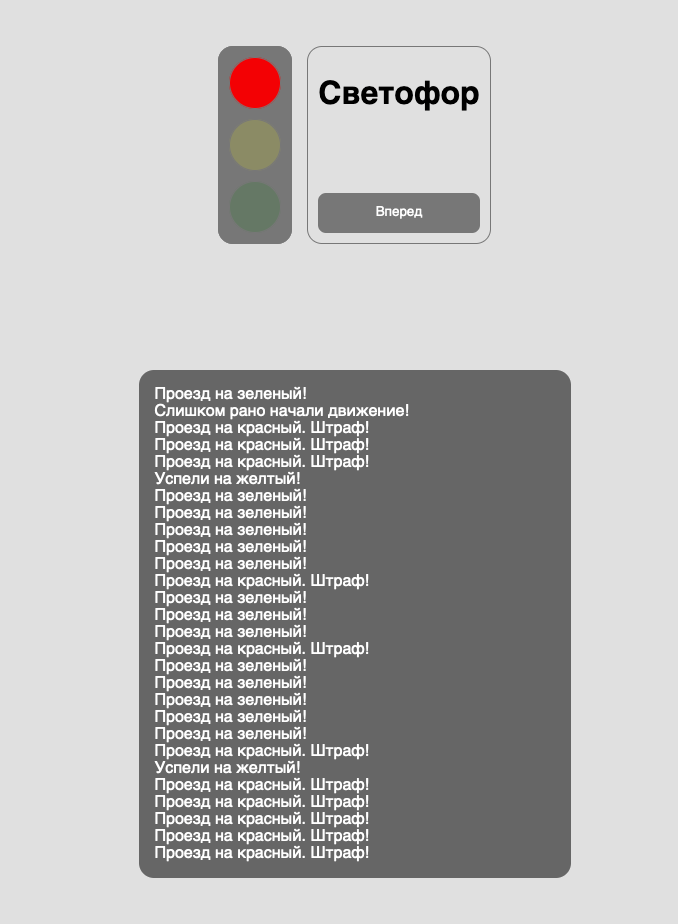

Светофор

1. Для непрямого взаимодействия с моделью Log реализовал репозиторий LogRepository, в котором сделал основные методы для взаимодействия с логами.
2. Все "непонятные" места описал в комментариях (почему такое или иное решение принято и т.д.)
3. Использовал Vite для компоновки ассетов, тк он объективно "свежее", нежели webpack
4. Использовал методику "тонких контроллеров", вынес весь функционал в сервис.
5. Для экономии места в БД использовал integer тип для хранения статусов (timestamps не отключал для контроля дат, но можно это сделать, будет еще экономнее), после чего получаю буквенный статус (для вывода) через репозиторий. Хотел сделать хелпер для более красивого кода в шаблоне, но хелперы - это довольно плохая практика, насколько я знаю.
6. Разбил код JS на функции для последующего возможного переиспользования.

